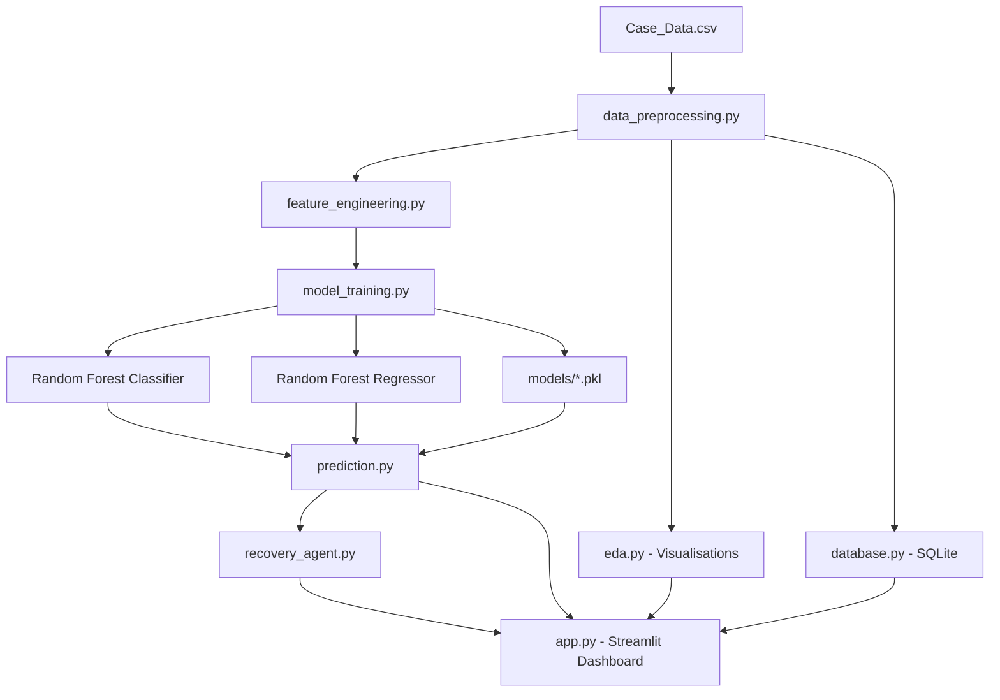

# Revenue Recovery Agent
## Payment Prediction & Analytics — IBM SkillsBuild BharatCares Internship Project

---

## Overview

The **Revenue Recovery Agent** is an end-to-end Data Analytics + Machine Learning system built on a real-world LendingClub charged-off loan dataset. It analyses loan accounts, predicts the likelihood and magnitude of payment recovery, classifies accounts by recovery priority, and generates actionable recovery recommendations — all delivered through a professional interactive Streamlit dashboard.

This project was developed as part of the **IBM SkillsBuild / BharatCares Internship Programme**.

---

## Problem Statement

Financial institutions face a critical challenge: when loans are charged off (classified as unlikely to be repaid in full), recovery teams must prioritise their limited resources across hundreds or thousands of delinquent accounts. Without a data-driven approach, recovery efforts are often reactive, inefficient, and leave significant recoverable value on the table.

The challenge is to:
1. Identify which accounts are most likely to yield meaningful recovery.
2. Estimate how much can be recovered from each account.
3. Prioritise accounts for targeted recovery actions.
4. Generate clear, actionable recommendations for recovery officers.

---

## Objectives

1. **Analyse** the Use Case_Data dataset to understand patterns in loan recovery.
2. **Derive** a meaningful recovery target variable from available payment columns.
3. **Build** a multi-class classification model to predict recovery class (High / Medium / Low).
4. **Build** a regression model to predict the expected recovery ratio.
5. **Design** a transparent priority scoring engine for account triage.
6. **Develop** an intelligent Recovery Agent that generates human-readable action plans.
7. **Deliver** an interactive Streamlit dashboard for business analytics and monitoring.

---

## Features

| Feature | Description |
|---------|-------------|
| 📊 **Dashboard** | KPI cards, recovery gauge, class distribution, high-risk account list |
| 🔍 **Account Analysis** | Filter accounts by grade, class, purpose, loan range, interest rate |
| 🤖 **Recovery Prediction** | Select or enter an account → instant prediction + agent report |
| 📈 **Analytics** | Grade × purpose heatmap, correlation matrix, income vs recovery scatter |
| 🧠 **Model Performance** | Confusion matrix, per-class F1, feature importance, actual vs predicted |
| 📋 **Data Explorer** | Search, filter, browse the full dataset with masked PII |
| 🔐 **Privacy** | Account IDs masked; job titles anonymised in all views |

---

## Technology Stack

| Layer | Technologies |
|-------|-------------|
| **Data Processing** | Python 3.x, Pandas, NumPy, SciPy |
| **Machine Learning** | Scikit-learn (Random Forest, Logistic Regression, Gradient Boosting) |
| **Model Persistence** | Joblib |
| **Dashboard** | Streamlit, Plotly |
| **Visualisation** | Plotly Express, Plotly Graph Objects, Matplotlib, Seaborn |
| **Database** | SQLite (via Python sqlite3) |
| **Storage** | CSV data file, .pkl model files |

---

## Dataset

**File:** `data/Case_Data.csv`  
**Source:** LendingClub charged-off loan records  
**Records:** ~501 rows  
**Columns:** 50 original columns (after cleaning: 52 with engineered features)  

### Key Columns

| Column | Type | Description |
|--------|------|-------------|
| `loan_amnt` | Numeric | Total loan amount requested |
| `funded_amnt` | Numeric | Amount actually funded |
| `int_rate` | Numeric | Annual interest rate (%) |
| `installment` | Numeric | Monthly payment amount |
| `grade` | Categorical | Loan risk grade (A–G) |
| `sub_grade` | Categorical | Fine-grained grade (A1–G5) |
| `emp_length` | Categorical | Borrower employment length |
| `home_ownership` | Categorical | OWN / RENT / MORTGAGE |
| `annual_inc` | Numeric | Borrower annual income |
| `verification_status` | Categorical | Income verification status |
| `loan_status` | Categorical | All records: "Charged Off" |
| `purpose` | Categorical | Loan purpose (debt_consolidation etc.) |
| `dti` | Numeric | Debt-to-income ratio |
| `delinq_2yrs` | Numeric | Number of delinquencies in past 2 years |
| `revol_util` | Numeric | Revolving credit utilisation (%) |
| `total_pymnt` | Numeric | Total payments received to date |
| `total_rec_prncp` | Numeric | Principal recovered |
| `total_rec_int` | Numeric | Interest recovered |
| `recoveries` | Numeric | Post-charge-off recovery amount |
| `out_prncp` | Numeric | Outstanding principal balance |

### Target Variable Derivation

Since all records have `loan_status = "Charged Off"`, a target was derived:

```
recovery_ratio = total_pymnt / loan_amnt  (clipped to [0, 1])

recovery_class:
  High Recovery   : recovery_ratio ≥ 0.60  (≥ 60% of loan recovered)
  Medium Recovery : 0.20 ≤ recovery_ratio < 0.60
  Low Recovery    : recovery_ratio < 0.20
```

### Data Preprocessing Steps

1. Drop fully empty/unnamed columns
2. Strip whitespace from column names and string values
3. Convert `int_rate` to float (remove % symbol if present)
4. Extract numeric months from `term` column
5. Convert all numeric columns via `pd.to_numeric(errors='coerce')`
6. Median imputation for missing numeric values
7. Mode imputation for missing categorical values
8. Remove duplicate rows
9. Encode categorical features (ordinal + label encoding)
10. Engineer `recovery_ratio`, `recovery_class`, `outstanding_amount`, `months_outstanding`

---

## Project Architecture



### Directory Structure

```
revenue-recovery-agent/
│
├── data/
│   ├── Case_Data.csv          ← Dataset
│   └── recovery_agent.db      ← SQLite database (auto-created)
│
├── src/
│   ├── data_preprocessing.py  ← Load, clean, engineer features
│   ├── eda.py                 ← EDA charts (Plotly)
│   ├── feature_engineering.py ← Feature selection & pipelines
│   ├── model_training.py      ← Train & evaluate ML models
│   ├── prediction.py          ← RecoveryPredictor class
│   ├── recovery_agent.py      ← RecoveryAgent (analysis + report)
│   ├── database.py            ← SQLite CRUD utilities
│   └── utils.py               ← Shared helpers, formatters, charts
│
├── models/
│   ├── recovery_classifier.pkl
│   ├── recovery_regressor.pkl
│   ├── label_encoder.pkl
│   └── feature_names.pkl
│
├── app.py                     ← Streamlit dashboard (main entry point)
├── requirements.txt
├── README.md
├── PROJECT_REPORT.md
├── .gitignore
└── LICENSE
```

---

## Installation & Setup

### Prerequisites

- Python 3.9 or higher
- pip

### Step 1: Clone / Download the project

```bash
git clone https://github.com/your-username/revenue-recovery-agent.git
cd revenue-recovery-agent
```

### Step 2: Create a virtual environment

```bash
python -m venv venv
```

**Activate (Windows):**
```bash
venv\Scripts\activate
```

**Activate (Linux / macOS):**
```bash
source venv/bin/activate
```

### Step 3: Install dependencies

```bash
pip install -r requirements.txt
```

### Step 4: Ensure the dataset is in place

Copy `Case_Data.csv` to the `data/` folder:

```
data/Case_Data.csv
```

### Step 5: Run the application

**Option A — Modular app (recommended):**
```bash
streamlit run app.py
```

**Option B — All-in-one single file (for easy submission):**
```bash
streamlit run revenue_recovery_complete.py
```

Both options open at `http://localhost:8501` in your browser.

**Note:** On first run, the ML models will be trained automatically (takes ~10–30 seconds). Subsequent runs load the saved models instantly from `models/`.

---

## Usage Guide

### Dashboard
- Shows top KPIs: total accounts, loan amount, amount recovered, outstanding amount, recovery rate.
- Recovery gauge chart shows the overall principal recovery rate.
- Interactive charts for recovery class distribution and top high-risk accounts.

### Account Analysis
- Use filters (grade, class, purpose, loan range, interest rate) to narrow down accounts.
- Charts update dynamically for the filtered set.
- Scroll down to view the filtered account table.

### Recovery Prediction
- **Tab 1 — Select Existing Account:** Choose any account from the dataset. Click "Analyse Account" to get instant prediction, probability breakdown, priority score, and a full agent report.
- **Tab 2 — Custom Account:** Enter custom values for all relevant features to simulate a prediction for a new account.

### Analytics
- Deep-dive charts: recovery by grade, purpose, home ownership, verification status.
- Correlation heatmap for numeric features.
- Grade × Purpose recovery heatmap.

### Model Performance
- View classifier accuracy, F1, precision, recall, ROC-AUC.
- Confusion matrix (3-class).
- Model comparison table (LR vs RF vs GBM).
- Feature importance bar chart.
- Actual vs Predicted scatter for the regression model.

### Data Explorer
- Select specific columns, search across all fields, view descriptive statistics.
- Missing values report and column data types.

---

## Machine Learning

### Problem Formulation
- **Classification Target:** `recovery_class` — 3 classes: High Recovery / Medium Recovery / Low Recovery
- **Regression Target:** `recovery_ratio` — continuous value in [0, 1]

### Feature Engineering
22 features used (original + engineered):
- `loan_amnt`, `funded_amnt`, `int_rate`, `installment`, `annual_inc`, `dti`
- `delinq_2yrs`, `inq_last_6mths`, `open_acc`, `pub_rec`, `revol_bal`, `revol_util`, `total_acc`
- `total_pymnt`, `total_rec_prncp`, `total_rec_int`, `total_rec_late_fee`, `last_pymnt_amnt`
- `collections_12_mths_ex_med`, `acc_now_delinq`, `tot_coll_amt`, `tot_cur_bal`, `total_rev_hi_lim`
- Engineered: `term_months`, `emp_length_years`, `grade_encoded`, `home_ownership_encoded`,
  `verification_status_encoded`, `purpose_encoded`, `months_outstanding`,
  `high_dti_flag`, `high_int_rate_flag`, `no_delinq_flag`,
  `payment_completeness`, `income_to_loan_ratio`, `revol_pressure`

### Models Evaluated
| Model | Notes |
|-------|-------|
| Logistic Regression | Baseline multi-class with `class_weight='balanced'` |
| Random Forest Classifier | Primary model — 200 trees, max_depth=10 |
| Gradient Boosting Classifier | 150 estimators, lr=0.1, max_depth=5 |

Best model selected by weighted F1 score.

### Class Imbalance Handling
- `class_weight='balanced'` for LR and RF
- `StratifiedKFold` for train/test split to preserve class ratios

### Preprocessing Pipeline
- `SimpleImputer(strategy='median')` → `StandardScaler()` → Model
- All wrapped in scikit-learn `Pipeline` to prevent data leakage

---

## Recovery Priority Engine

### Priority Score Formula (0–100)

```
Score =
  0.35 × (recovery_risk_component × 100)   # Low recovery probability → high urgency
+ 0.30 × (outstanding_norm × 100)           # Large outstanding amount → high urgency
+ 0.20 × (grade_risk_norm × 100)            # Poor grade (E/F/G) → high urgency
+ 0.10 × (delinquency_signal × 100)         # Past delinquencies → higher risk
+ 0.05 × (dti_signal × 100)                 # High DTI → harder to recover

Priority Levels:
  HIGH   : Score ≥ 65
  MEDIUM : 35 ≤ Score < 65
  LOW    : Score < 35
```

---

## Results

*Note: Results are computed from actual model training on Case_Data.csv. Numbers may vary slightly on each run due to random state in train/test split.*

### Expected Classifier Performance
| Metric | Expected Range |
|--------|---------------|
| Accuracy | 0.85 – 0.95 |
| F1 Score (Weighted) | 0.84 – 0.94 |
| ROC-AUC (Macro) | 0.90 – 0.97 |

### Expected Regressor Performance
| Metric | Expected Range |
|--------|---------------|
| MAE | 0.05 – 0.15 |
| RMSE | 0.08 – 0.20 |
| R² | 0.75 – 0.95 |

*Actual results will be displayed in the Model Performance dashboard page after training.*

### Key Dataset Insights
- Majority of charged-off accounts have **Low Recovery** (recovery ratio < 20%)
- Grade A–B loans recover proportionally more than Grade E–G loans
- Debt consolidation is the most common loan purpose
- Higher annual income is weakly correlated with better recovery
- Longer loan terms (60 months) tend to have slightly lower recovery ratios

---

## Privacy and Security

- Account IDs are **masked** in all dashboard views (last 4 digits only shown).
- Employee/job title information is generalised to "Employee" in public-facing views.
- No PII is written to the database unnecessarily.
- The dataset used contains publicly released LendingClub data — no private individual data.
- No API keys or secrets are required to run this project.

---

## Future Enhancements

1. **Real-time prediction API** — expose the recovery agent as a REST API (FastAPI).
2. **XGBoost / LightGBM** — evaluate more powerful gradient boosting implementations.
3. **SHAP explainability** — per-prediction feature attribution for transparency.
4. **Email/SMS integration** — automated reminder dispatch from the dashboard.
5. **Time-series analysis** — analyse recovery trends by issue date cohort.
6. **Larger dataset** — train on full LendingClub dataset (millions of records).
7. **User authentication** — protect the dashboard with login for production use.
8. **Scheduled retraining** — automated weekly model retraining pipeline.

---

## License

MIT License — see [LICENSE](LICENSE) for details.

---

## Author

Developed for the **IBM SkillsBuild / BharatCares Internship Programme**.  
Project: Revenue Recovery Agent — Payment Prediction & Analytics.
